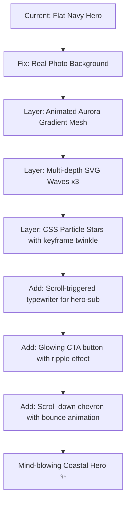

# Design Review: Hero Section — Desa Campurejo

**Review Date**: 2026-03-07  
**File**: `index.html` — Hero Section (`#hero`)  
**Focus Areas**: Visual Design · Responsive/Mobile  
**Inspiration**: Visit Indonesia, awwwards maritime winners, aurora/gradient-mesh hero trends

---

## Summary

The hero has a strong typographic foundation (Playfair Display + Inter pairing is excellent) and a creative concept (animated waves, parallax, shell cursor), but is critically undermined by a missing background image that causes the entire hero to render as a flat navy rectangle. Beyond the broken image, the hero lacks modern depth — no aurora/gradient mesh, no scroll CTA, no particles — and has several responsive breakdowns on mobile. The interactive concept is solid; the execution just needs a major visual upgrade.

---

## Issues

| # | Issue | Criticality | Category | Location |
|---|-------|-------------|----------|----------|
| 1 | **Missing `Images/hero-bg.jpg`** — file does not exist at that path (actual images are inside `Images/P9/`). Hero shows only the flat `#001a4d` fallback — zero visual richness | 🔴 Critical | Visual Design | `index.html:189` — `.hero { background: url('Images/hero-bg.jpg') }` |
| 2 | **No scroll CTA / scroll indicator** — hero has no button, chevron, or animated arrow to prompt users to scroll; large dead space in upper 60% of hero with no engagement | 🟠 High | Visual Design | `index.html:926–938` — `.hero-content` block, after `.hero-sub` |
| 3 | **Stars are imperceptible** — only 6 radial-gradient dots of 1–1.5px; completely invisible against the navy background; the "night sky" effect doesn't read at all | 🟠 High | Visual Design | `index.html:239–248` — `.hero-stars` radial gradients |
| 4 | **Hero upper 60% is a visual void** — `align-items: flex-end` pins all content to the bottom. Without a background image, the top two-thirds of the 100vh hero is completely empty and unengaging | 🟠 High | Visual Design | `index.html:181–191` — `.hero` flexbox + `align-items: flex-end` |
| 5 | **No animated gradient mesh / aurora effect** — modern "wow" coastal heroes (Visit Indonesia, awwwards maritime winners) use layered animated conic/radial gradient meshes or aurora-style keyframe animations for immersive depth without needing a photo | 🟠 High | Visual Design | `index.html:196–198` — `.hero-bg` gradient overlay (single layer only) |
| 6 | **Emoji boat `⛵` renders as platform emoji** — OS-dependent rendering means it looks like a flat colorful emoji on Windows, not a styled coastal icon. Inconsistent cross-platform appearance | 🟡 Medium | Visual Design | `index.html:921–924` — `.boat-hotspot .boat-icon` |
| 7 | **Hero eyebrow wraps on mobile (390px)** — `"DESA PESISIR · KECAMATAN PANCENG · GRESIK"` breaks into 2 lines at 390px viewport due to long text and wide letter-spacing; no mobile-specific font-size reduction | 🟡 Medium | Responsive | `index.html:927` — `.hero-eyebrow` + `index.html:349–356` — CSS `.hero-eyebrow` (no mobile override) |
| 8 | **`100vh` instead of `100svh`** — on iOS Safari the address bar eats into `100vh`, cutting off the bottom of the hero (wave divider + content). Use `100svh` with `100vh` fallback | 🟡 Medium | Responsive | `index.html:182` — `.hero { height: 100vh }` |
| 9 | **Border labels "KAB. GRESIK / KAB. LAMONGAN" are too close together on mobile** — at 390px the labels (`right: calc(50% + 16px)` and `left: calc(50% + 16px)`) nearly overlap and compete visually with the center divider line | 🟡 Medium | Responsive | `index.html:272–279` — `.border-label.left` / `.border-label.right` CSS (no mobile hide/adjust) |
| 10 | **No mobile padding adjustment for `.hero-content`** — padding is `4rem 6%` on all screen sizes. On 390px this gives ~23px horizontal padding which is fine, but `4rem` top padding conflicts with the `align-items: flex-end` making content clip the wave divider at the bottom | 🟡 Medium | Responsive | `index.html:327–335` — `.hero-content { padding: 4rem 6% }` (no `@media` override) |
| 11 | **Hero title `clamp` lower bound too small on mobile** — `clamp(3.5rem, 8vw, 7rem)` at 390px → `8vw = 31.2px`. The actual lower bound `3.5rem = 56px` saves it, but `8vw` as the preferred value is too small for mid-range screens (480–600px: 38–48px) | 🟡 Medium | Responsive | `index.html:359` — `.hero-title { font-size: clamp(3.5rem, 8vw, 7rem) }` |
| 12 | **Wave layers lack visual pop** — only 2 SVG wave paths with opacity 0.25 and 0.2. Adding a 3rd solid wave layer, varying amplitude, and color diversity (e.g. deep teal + midnight blue) would create much more dramatic depth | 🟡 Medium | Visual Design | `index.html:909–914` — `.hero-wave` SVG paths |
| 13 | **Sound button has no label on mobile** — fixed bottom-left `🐚` button has `title` attribute (desktop tooltip) but no visible label. Mobile users have no context for what it does | ⚪ Low | Visual Design | `index.html:1084` — `#sound-btn` element |
| 14 | **`cursor: none` on `body` hides the cursor outside hero too** — while `.body.outside-hero { cursor: auto }` exists, it's never toggled in JS. The shell cursor logic only fires on hero mouse events, so users get `cursor: none` on the entire page | ⚪ Low | Visual Design | `index.html:46` — `body { cursor: none }` + `index.html:1098–1100` — hero mouseenter/leave handlers |
| 15 | **Hero `hero-bg.jpg` referenced from wrong path** — actual village photos are in `Images/P9/` (e.g. `Campurejo.jpg`, `img1.jpg` etc). A real coastal photo from that folder would transform the hero immediately even before other improvements | 🔴 Critical | Visual Design | `index.html:189` — use `Images/P9/Campurejo.jpg` or `Images/P9/img1.jpg` as interim fix |

---

## Criticality Legend
- 🔴 **Critical**: Breaks functionality or dramatically undermines visual impact
- 🟠 **High**: Significantly impacts user experience or design quality
- 🟡 **Medium**: Noticeable issue that should be addressed
- ⚪ **Low**: Nice-to-have improvement

---

## "Blow Minds" Upgrade Roadmap

These are design patterns from top-tier coastal/cultural hero sections that would elevate this hero to award-winning level:

### Priority Quick Wins (1–2 hours)
1. **Fix the image path** → `Images/P9/Campurejo.jpg` (5 min, massive impact)
2. **Add `100svh` fallback** → fixes iOS Safari clipping (2 min)
3. **Add a CTA button** → e.g. `<a href="#jelajahi" class="hero-cta">Jelajahi Desa ↓</a>` with gold border + hover glow
4. **Hide border labels on mobile** → `@media (max-width: 600px) { .border-label { display: none } }`
5. **Enhance stars** → increase to 20+ points with CSS `animation: twinkle 3s ease-in-out infinite alternate`

### Medium Effort (2–4 hours)
6. **Aurora gradient overlay** → animated `@keyframes` rotating conic-gradient behind the image
7. **3rd wave layer** → solid deep teal `rgba(0,80,100,1)` that connects to the stats section seamlessly
8. **Replace emoji boat** → SVG icon (or a CSS-drawn sailboat) for cross-platform consistency

### Advanced (4–8 hours)
9. **CSS canvas particles** — pure CSS animated dots using `::before`/`::after` + `box-shadow` trick (no JS needed)
10. **Scroll-triggered text reveal** — split `.hero-title` into individual letters with staggered `animation-delay`
11. **Tilt 3D card effect on hero content** — the parallax is already there, extend it to the text block too
